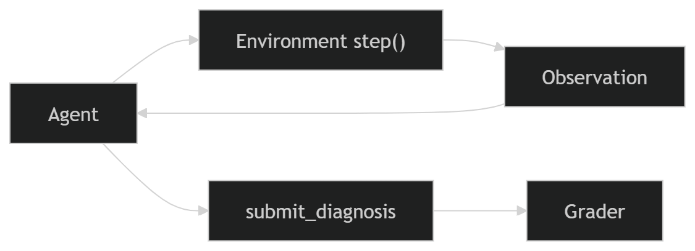

# Incident RCA Environment

IncidentRCAEnv is a reinforcement learning environment designed for training and evaluating agents on distributed system root cause analysis through multi-step diagnostic investigation.



## Overview

IncidentRCAEnv provides a deterministic benchmark for evaluating the diagnostic reasoning of AI agents in microservice architectures. Unlike standard coding tasks, this environment requires agents to navigate a complex, partially observable service mesh where failure symptoms propagate across dependencies. Agents must analyze logs, metrics, and traces to locate and diagnose terminal service failures with high efficiency.

## Core Concept

The environment simulates realistic production incidents. When an episode begins, a failure scenario is injected into the backend graph. An agent is notified via a set of initial alerts and must resolve the incident by:
1. Tracing dependencies from the alerting service to the source of the failure.
2. Gathering corroborating evidence via metrics and log analysis.
3. Submitting a diagnosis with both the correct service name and the precise failure mode.

The system rewards evidence-driven investigation and applies penalties for redundant or blind exploration, ensuring that high-performing agents are those with strong reasoning capabilities rather than brute-force heuristics.

## Why This Problem Is Challenging

Root Cause Analysis (RCA) in distributed systems is a high-dimensional reasoning problem for the following reasons:
- Cascade Propagation: Failures propagate across multiple services, meaning the alerting symptoms (symptoms) are often distinct from the root cause.
- Signal Noise: Logs and metrics may contain historical errors or transient spikes (red herrings) that are unrelated to the current incident.
- Evidence Synthesis: Agents must combine information from multiple heterogeneous tools (logs, metrics, and distributed traces) to build a consistent mental model of the failure.
- Reasoning Depth: The environment requires multi-step diagnostic reasoning where every action is a hypothesis test, rather than single-shot pattern matching.

---

## Action Space

The action space consists of five atomic tools representing real-world SRE (Site Reliability Engineering) operations. All actions are requested as structured JSON objects.

| Action | Parameters | Description |
| --- | --- | --- |
| query_dependencies | service | Returns the upstream and downstream dependency list for a specific node in the mesh. Essential for blast radius analysis. |
| grep_logs | service, keyword | Performs a keyword-based search on the recent logs of a service. Used to identify specific error signatures. |
| query_metrics | service, metric_name | Retrieves time-series data to identify saturation or anomalies. Common `metric_name` values include **cpu_util**, **memory_usage**, **connection_count**, and **disk_usage**. |
| fetch_traces | request_id | Returns a distributed span trace, allowing the agent to follow the path of a specific failing request across multiple services. |
| submit_diagnosis | root_cause_service, cause_type | Finalizes the investigation. Submitting a diagnosis immediately terminates the episode and initiates grading. |

## Observation Space

At each step, the environment returns a JSON observation containing the current system state.

### Observation Schema (Simplified)

```json
{
  "step": 4,
  "max_steps": 25,
  "task_description": "API Gateway 502 errors reporting upstream failure...",
  "alerts": [
    {"id": "ALT-001", "service": "api-gateway", "severity": "critical", "message": "502 Bad Gateway"}
  ],
  "tool_result": {
    "logs": [
      {"timestamp": "2026-04-12T10:00:01Z", "level": "ERROR", "message": "Connection refused to mysql:3306"}
    ]
  },
  "history": [
    {"action": "query_dependencies", "parameters": {"service": "api-gateway"}, "reward": 0.05}
  ],
  "done": false
}
```

---

## Task Hierarchy

The environment includes 17 tasks categorized into three difficulty levels to ensure a comprehensive evaluation of agent reasoning:

### Easy (Tasks 001 - 007)
Direct service failures where symptoms and root causes are localized. Designed to verify basic tool usage and understanding of error messages. Examples include database connection pool exhaustion and simple OOM (Out of Memory) kills.

### Medium (Tasks 001 - 005)
Single-level dependency cascades. The alerting service is a victim of a failure in a direct upstream dependency. Agents must follow the dependency graph to find the root cause. Examples include slow database queries causing API gateway timeouts.

### Hard (Tasks 001 - 005)
Deep cascades and non-obvious failure modes. Failures might be hidden three or four levels deep in the mesh or involve complex distributed system issues like network partitions (split-brain) or configuration drift across the mesh.

---

## Score Distribution

This benchmark provides strong differentiation between varying levels of agent intelligence.

| Agent Type | Score Range | Description |
| --- | --- | --- |
| Random Agent | 0.20 - 0.35 | Submits invalid actions or random services without evidence. |
| Naive LLM | 0.40 - 0.60 | Finds the alerting service but fails to trace the cascade to the root cause. |
| Baseline Agent | 0.60 - 0.75 | Correctly identifies root cause services but provides imprecise failure modes. |
| Optimized Agent | 0.80 - 0.95 | High-efficiency solver that identifies service and cause with minimal tool steps. |

## The Grading Engine

The environment uses a deterministic, efficiency-aware grading system to calculate a final score between 0.01 and 0.99. The score is calculated using the following formula:

Score = (Base Accuracy x 0.85) + (Efficiency x 0.15)

> [!NOTE]
> This environment implements a dual-evaluator system. The `openenv.yaml` includes LLM-based graders for seamless platform compatibility and universal validator support. However, the core environment internally supports a highly sophisticated, deterministic Python-based grader used for deep local evaluation and efficiency-blended scoring.


### Accuracy Components
- Service Identification (50%): Awarded for diagnosing the exact terminal service where the fault originated.
- Failure Mode Identification (30%): Awarded for correctly identifying the cause type (e.g., TLS expiry vs DNS corruption).
- Evidence Requirements (20%): Verifies that the agent actually queried the service it diagnosed, preventing success via guessing.

### Efficiency Metric
Efficiency is calculated as the ratio of optimal steps (predefined for each difficulty level) to the actual steps taken. Agents that reach the correct diagnosis faster receive higher scores.

---

## The Reward System

Incremental feedback is provided at every step through trajectory-shaping rewards:

- Dependency Path Reward (+0.05): Granted when the agent investigates a service that is in the actual failure cascade path.
- Root Cause Discovery (+0.05): Granted the first time an agent interacts with the terminal root cause service.
- Repetition Penalty (-0.15): A strict penalty applied if the agent repeats the exact same tool call with the same parameters, discouraging loops.
- Step Penalty (-0.01): A small per-step deduction to provide constant pressure toward efficient resolution.

---

## Detailed Example (medium_001)

Incident Description: Search API latency is high. A developer recently dropped an index in the backend MySQL database.

1. START: Agent receives an alert: service=search-api, message="p99 > 8s".
2. STEP 1: query_dependencies(service=search-api)
   - Result identifies that search-api depends on [mysql].
3. STEP 2: fetch_traces(request_id=trace_101)
   - Result shows that the search-api request is spending 95% of its time waiting for a response from mysql.
4. STEP 3: grep_logs(service=mysql, keyword=slow)
   - Result reveals: "Slow query detected: SELECT * FROM items... Table scan required due to missing index".
5. STEP 4: submit_diagnosis(root_cause_service=mysql, cause_type=missing index slow query)
   - Grading: Correct service, correct cause, minimal steps taken.
6. RESULT: Success=true, Score=0.94.

---

## Setup and Usage

### Installation
1. Clone the repository.
2. Install the package in editable mode:
   pip install -e .

### Configuration
Create a .env file with your model credentials:
API_BASE_URL=your_endpoint
HF_TOKEN=your_huggingface_token
MODEL_NAME=meta/llama-3.3-70b-instruct

### Running Evaluation

The environment supports two evaluation modes depending on your resource availability and validation requirements.

#### Default Run (Validator Safe - 7 Tasks)
```bash
python inference.py
```
- Runs a balanced subset of 7 tasks (3 easy, 2 medium, 2 hard).
* Optimized for reliable scoring and avoids platform rate limits during the final submission.

#### Full Benchmark Run (All 17 Tasks)
```bash
MAX_TASKS=17 python inference.py
```
- Runs the complete incident suite.
* Recommended for full reasoning evaluation and high-resolution leaderboard benchmarking.

## Baseline Results

Model: meta/llama-3.3-70b-instruct

| Difficulty | Avg Score |
| --- | --- |
| Easy | 0.95 |
| Medium | 0.87 |
| Hard | 0.78 |

**Overall Average Score: 0.87**

---

## Design Decisions and Limitations

### Source of Truth
All failure scenarios, dependency graphs, and incident states are defined in `incident_rca_env/environment/scenario_generator.py`, which serves as the ground truth for incident generation and grading alignment.

### Determinism
All scenarios are generated deterministically from a fixed seed. This ensures that benchmark results are reproducible across different models and evaluation runs.

### Current Limitations
- The environment currently focus on single root-cause incidents. 
- Dependency graphs are static within an episode and do not reflect real-time network changes.

## Future Improvements
- Multi-incident scenarios where multiple independent failures occur simultaneously.
- Interactive remediation allowing agents to execute "fix" actions and observe system recovery.
- Enhanced telemetry including more varied metric types like ingress/egress bandwidth and garbage collection frequency.
